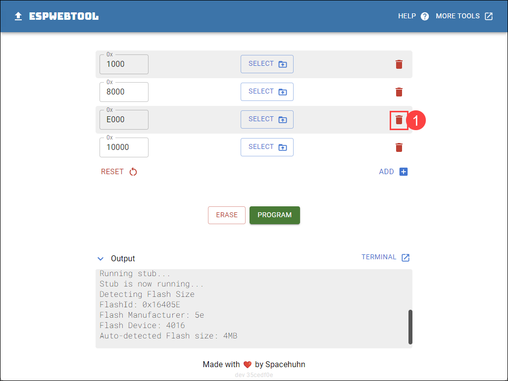
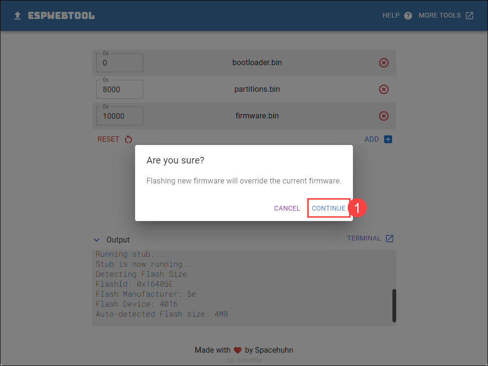

# OzSec Model 2023 Badge (Version 2023.5)

Welcome to the OzSec Model 2023 badge firmware repo. Here you will find updated code for the OzSec 2023 badges.

This new firmware includes both the original functionality of the badge as seen at OzSec 2023, as well as new
firmware that unlocks a new text based interaction with S1M0N, and code that makes this badge somewhat desirable during OzSec 2024!

We also now support Over-the-Air updates to the badge firmware, and the ability to choose which code to run, the original
Model 2023 or the new Model 2023: S1M0N code.


|  |  |
|:--:|:--:|
| Front | Back |

## Links
- [Installing Firmware](#installing-firmware-with-espwebtool)
- [Accessing Serial Console](#interacting-with-your-badge)
- [Update WiFi Settings](#changing-wifi-credentials)
- [Tips](#tips)

## Installing Firmware with ESPWebTool

The latest firmware supports over the air updates, as long as WiFi is configured properly and the badge is connected to the Internet.
The original OzSec 2023 badge firmware did not get this feature in time for the conference.

- Download the latest [firmware.bin](https://www.lightthebadge.com/ota/2023/firmware.bin) and [bootloader.bin](https://www.lightthebadge.com/ota/2023/bootloader.bin).

- Plug your badge into your computer with a USB-C cable.
> Note that it must be a data USB-C cable, not a power only cable. If you don't see a COM port for your badge, and installing drivers doesn't help, try a different cable.

- Power on the badge if needed by flipping the power switch on the bottom of the badge, by the USB port, away from the usb port.
<p align=center>

</p>

- Put your badge into bootloader mode, to allow it to be flashed. Hold the BOOT and RESET buttons on the back of the badge at the same time. Release the RESET button, then after a second release the BOOT button. 
<p align=center>

</p>


- Visit [ESPWebTool by Spacehuhn](https://esp.huhn.me/) in Chrome, Edge, or Opera from a desktop PC.

- Click the green `Connect` button.
<p align=center>

</p>

- In the browser popup, select the `USB Serial (COM#)` and then click `Connect`
> Drivers should be built into most modern operating systems. However, if you cannot get your badge to show up with a COM port, download the drivers for your operating system directly from the manufacturer of the chipset: [https://www.wch-ic.com/downloads/CH341SER_ZIP.html](https://www.wch-ic.com/downloads/CH341SER_ZIP.html)
<p align=center>

</p>

- The site will connect to the ESP32 chip that powers your badge.
<p align=center>

</p>

- Once the badge is connected, four file upload options will show up. 
<p align=center>

</p>

- Click the delete icon on the bottom two rows, we only need two of them.

- Enter `0` and browse to your `bootloader.bin` for the first option.

- Enter `10000` and browse to your `firmware.bin` for the second option.
<p align=center>

</p>

- Click `Program` to start.
<p align=center>

</p>

- A popup will appear asking if you are sure, click `Continue` to proceed.
<p align=center>

</p>

- The flashing process will start, this may take a few minutes.
<p align=center>

</p>

- Once completed, you will see `Done! reset your device` in the Output window. 
<p align=center>

</p>

- You can now press the RESET button on the back of your badge, or power it off and back on to load the new firmware. Check the following section on interacting with your badge for details on how to connect to your badge via the serial console.

### Troubleshooting ESPWebTool

You may run into a few different scenarios where the ESPWebTool fails to connect to your badge. Almost all of these can be solved by resetting the serial permissions on your browser. 

To reset the serial permissions:

- Click the lock icon in the address bar, to the left of the URL.

- Click `Reset permission` under the USB Serial section.

- Reload the website and try connecting to your badge again.
<p align=center>

</p>


## Interacting With Your Badge

- Power on the badge if needed by flipping the power switch on the bottom of the badge, by the USB port, away from the usb port.
> Note that it must be a data USB-C cable, not a power only cable. If you don't see a COM port for your badge, and installing drivers doesn't help, try a different cable.

- Visit [Serial Terminal by Spacehuhn](https://serial.huhn.me/) in Chrome, Edge, or Opera from a desktop PC.

- Click the green `Connect` button.
<p align=center>

</p>

- In the browser popup, select the `USB Serial (COM#)` and then click `Connect`
<p align=center>

</p>

- The serial terminal will load, and you will see the serial output from your badge. 
<p align=center>

</p>

- If needed, reset your badge by pressing the RESET button on the top right hand side of your badge.

## Changing WiFi Credentials

You will probably need to update the WiFi settings of your badge so that it connects to your local WiFi to get firmware updates over-the-air. 

You can do this by connecting to the badge over the Serial console (See [Interacting With Your Badge](#interacting-with-your-badge) above) and switching to the `Model 2023` codebase by holding the RIGHT button while it is powered on.

If you are connected to the serial console during this, you will see the messages change to:
```
Hold BOOT to start OTA firmware update.
Hold RIGHT to switch to S1M0N codebase.

Press enter to activate the serial console.
```

This means you are in the Model 2023 codebase.

1. Press enter to bring up the serial interface. 
2. Press enter to login to the main menu.
3. Enter option 7 FIRMWARE OPTIONS
4. Enter option 1 CONFIGURE WI-FI

From here, change the SSID and repeat to change the Passphrase as needed. Exit the main menu, and power off and power on your badge. It should now be able to connect to the Internet via your WiFi network and you can press and hold the BOOT button to initiate a firmware update and check if a new firmware is available.


## Tips
- Pinch the USB-C port between your fingers while you plug or unplug the USB-C cable. This reduces the risk of breaking off the USB-C port from the board.
- Be careful when toggling the power switch on the board as the switch can break.
